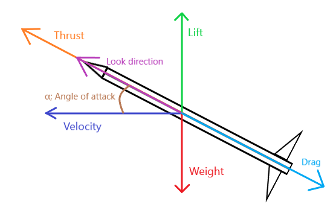

## Physics properties allow you to simulate realisitic physics

To access these properties, you first need to require the module:

```lua
local HomingCast = require(.../HomingCast)
```

Then, create the properties:

```lua
local PhysicsProperties: {} = HomingCast.NewPhysicsProperties()
```

!!! question "How does this physics work?"
    This physics is based on missile's physics

    { width="450", height="150" }

!!! danger "Beware!"
    If you use physics, do not set physics properties to extremely high values as it can lead to jittering

    **Everything must be balanced**

## Here's all properties

---

### Mass
```lua
PhysicsProperties.Mass :: number
```
Mass of the cast

---

### LiftPower
```lua
PhysicsProperties.LiftPower :: number
```
This is a constant for the lift coefficient. Determines aerodynamic capabilities of the cast for pitch

---

### YawPower
```lua
PhysicsProperties.YawPower :: number
```
This is a constant for the yaw coefficient. Determines aerodynamic capabilities of the cast for yaw

---

### DragCoefficient
```lua
PhysicsProperties.DragCoefficient :: number
```
Determines the resistance of the cast in a fluid environment

---

### InducedDragYaw
```lua
PhysicsProperties.InducedDragYaw :: number
```
Determines the resistance of the cast in a fluid environment when rotating on the yaw axis

---

### InducedDragPitch
```lua
PhysicsProperties.InducedDragPitch :: number
```
Determines the resistance of the cast in a fluid environment when rotating on the pitch axis

---

### ThrustPower
```lua
PhysicsProperties.ThrustPower :: number
```
Sets the force which constantly pushes the cast in its look direction

---

### PitchAoA
```lua
PhysicsProperties.PitchAoA :: {}
```
This is a list which determines the lift coefficient at some angle of attack

!!! example "Example"
    ```lua
    PhysicsProperties.PitchAoA = {
        {["Value"] = -0.12,["AoA"] = -65},
        {["Value"] = -1,["AoA"] = -25},
        {["Value"] = 0,["AoA"] = 0},
        {["Value"] = 1,["AoA"] = 25},
        {["Value"] = 0.12,["AoA"] = 65}
    }
    ```

!!! danger "Recommendations"
    ```Value``` should be from [**-1** to **1**].
    But you can set to any value you want

!!! question "How do I get this table?"
    Use my [plugin](https://create.roblox.com/store/asset/97281486618608/HomingCast-Plugin) for this and change the mode to ```AoA```

    Read about it [here](CustomTrajectories.md)

---

### YawAoA
```lua
PhysicsProperties.YawAoA :: {}
```
This is a list which determines the yaw coefficient at some angle of attack yaw

!!! example "Example"
    ```lua
    PhysicsProperties.YawAoA = {
        {["Value"] = -0.12,["AoA"] = -65},
        {["Value"] = -1,["AoA"] = -25},
        {["Value"] = 0,["AoA"] = 0},
        {["Value"] = 1,["AoA"] = 25},
        {["Value"] = 0.12,["AoA"] = 65}
    }
    ```

!!! danger "Recommendations"
    ```Value``` should be from [**-1** to **1**].
    But you can set to any value you want

!!! question "How do I get this table?"
    Use my [plugin](https://create.roblox.com/store/asset/97281486618608/HomingCast-Plugin) for this and change the mode to ```AoA```

    Read about it [here](CustomTrajectories.md)

---

!!! info "Remember"
    The ```Value``` will be smoothed from one to another value based on given angle of attack (pitch / yaw)
      
---

### MaxAngle
```lua
PhysicsProperties.MaxAngle :: number
```
You can consider this as a G limit, but currently is used just to get proper corner velocity
      
---

### AdditionalForces
```lua
PhysicsProperties.AdditionalForces :: Vector3
```
Additional force which will effect on the cast constantly