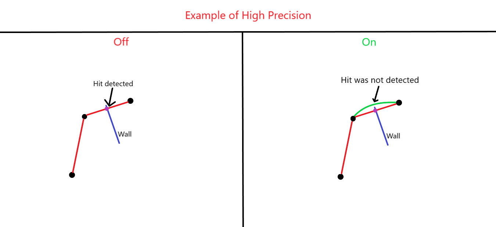

To access properties, you first need to require the module:

```lua
local HomingCast = require(.../HomingCast)
```

Then, create the properties:

```lua
local Properties: {} = HomingCast.NewProperties()
```

!!! question "Can I create more `Properties`?"
    Yes, you can! This can be useful for different scenarios. For example, if your spell hits something and creates sub-spells, you can create additional properties to give them different behaviors

## There are a lot of properties and they all are listed here!

---
### MaxDistance
```lua
Properties.MaxDistance :: number
```
If the cast covers this distance, it will be terminated

!!! info "Terminated!"
    This will fire:
    ```lua
    Caster.Terminated(InfoCast, Reason: string, CosmeticBullet: BasePart?, UserData: {})
    ```
    The `Reason` will be `"MaxDistance"`

---
### MaxFlyTime
```lua
Properties.MaxFlyTime :: number
```
If the cast flies longer than this value, it will be terminated

!!! info "Terminated!"
    This will fire:
    ```lua
    Caster.Terminated(InfoCast, Reason: string, CosmeticBullet: BasePart?, UserData: {})
    ```
    The `Reason` will be `"MaxFlyTime"`

---
### RotationSpeed
```lua
Properties.RotationSpeed :: number
```
Defines the speed at which the cast turns

---
### RaysPerMove
```lua
Properties.RaysPerMove :: number
```
Determines how many raycasts will be fired in one move.

!!! danger "Performance Warning!"
    Setting this value too high (e.g., 20 or more) can cause significant lag
    
    Recommended values range from **1 to 5**

---
### MaxAngleToLoseTheTarget
```lua
Properties.MaxAngleToLoseTheTarget :: number
```
If the target moves outside this angle, the cast will lose track of it

---
### SimulateBeforePhysics
```lua
Properties.SimulateBeforePhysics :: boolean
```
If `true`, the projectile will be simulated before physics calculations (Optional)

---
### RayCastParams
```lua
Properties.RayCastParams :: RaycastParams
```
Defines the `RaycastParams` for the cast (Optional)

---
### CosmeticBulletFolder
```lua
Properties.CosmeticBulletFolder :: any?
```
The folder used to contain cosmetic bullets

---
### CosmeticBulletTemplate
```lua
Properties.CosmeticBulletTemplate :: any?
```
The cosmetic bullet itself

---
### Prediction
```lua
Properties.Prediction :: boolean
```
If `false`, target prediction is disabled. If `true` then module will predict the target's future position based on its velocity and position

---
### Trajectory
```lua
Properties.Trajectory :: {}?
```
If not `nil`, the projectile will attempt to follow the given trajectory. (Optional)

For more information, see [Custom Trajectories](CustomTrajectories.md).

!!! example "Example"
    ```lua
    Properties.Trajectory = {
        {Yscale = 0.3, Xscale = 0.12220414727926254, State = "Free", MaxHeight = 150},
        {Yscale = 0.6, Xscale = 0.310281366109848, State = "Free", MaxHeight = 150},
        {Yscale = 0.6, Xscale = 0.903989744186401, State = "Free", CheckPoint = "Above", MaxHeight = 150},
    }
    ```

---
### HighPrecision
```lua
Properties.HighPrecision :: number
```
If this value is greater than `0` (e.g., `0.1, 0.2, 0.3, ..., 1`), the module will perform a secondary accuracy check after a low-fidelity raycast detects a hit. This value determines how precise the recalculations will be. (Optional)

{ width="600", height="300" }

!!! danger "Performance Warning!"
    Setting this value to extreme small numbers (e.g., `0.01` or smaller) can cause significant lag
    
    Recommended values range from **0.1**

---
### Offset
```lua
Properties.Offset :: ((TotalTime: number, DeltaTime: number, TargetPosition: Vector3, CurrentPosition: Vector3) -> (Vector3))?
```
This function affects the target's position

!!! example "Example"
    ```lua
    Properties.Offset = function(TotalTime, DeltaTime, TargetPosition, CurrentPosition)
        return Vector3.new(0, 10, 0)
    end
    ```
    The projectile will fly above the target's actual position

!!! info "How does **Offset** work?"
    ```luau
    TargetPosition += Offset(TotalTime, DeltaTime, TargetPosition, CurrentPosition)
    ```

---
### Scaler
```lua
Properties.Scaler :: ((TotalTime: number, DeltaTime: number, TargetPosition: Vector3, CurrentPosition: Vector3) -> (Vector3 | number))?
```
This function affects the target's position

!!! info "How does **Scaler** work?"
    ```luau
    TargetPosition *= Scaler(TotalTime, DeltaTime, TargetPosition, CurrentPosition)
    ```

!!! danger "Remember!"
    First, the target's position will be scaled, and then an offset will be applied
    ```luau
    TargetPosition = TargetPosition * Scaler(...) + Offset(...)
    ```

---
### UserData
```lua
Properties.UserData :: {[any]: any}
```
Stores custom data